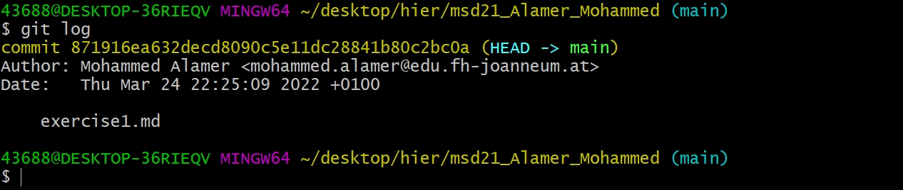

# Exercise 2 - learning the git commands

## git commands that you can use:

- `git configurate --global` can be used to set global username and 
user email

- `git init` is can be used to initialize git repositories

- `git commit` saves all staged changes, along with a brief description from the user

- `git status` used to display the state of the repository and staging area

- `git add` this command adds files to the staging area

- `git log` displays all commits that were made to a repository

**Beispiel:**

- `git diff` displays differences between commits

- `git push` is used to push local content to a remote repository

- `git pull` is used to get remote content into local repository

### usage of this commands

if you have any difficulties by using this commands, you could always use google to search for solutions, or you can look some up at **Stack Overflow**.