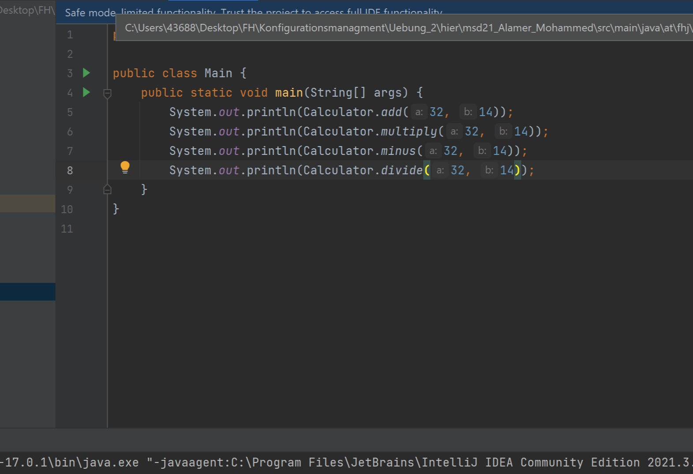
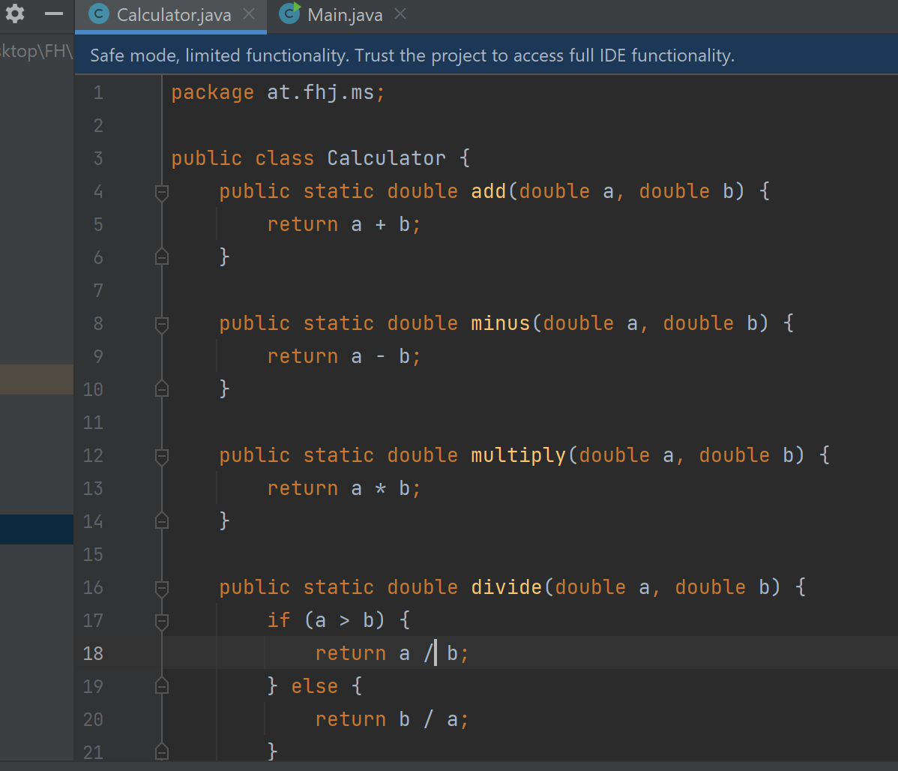
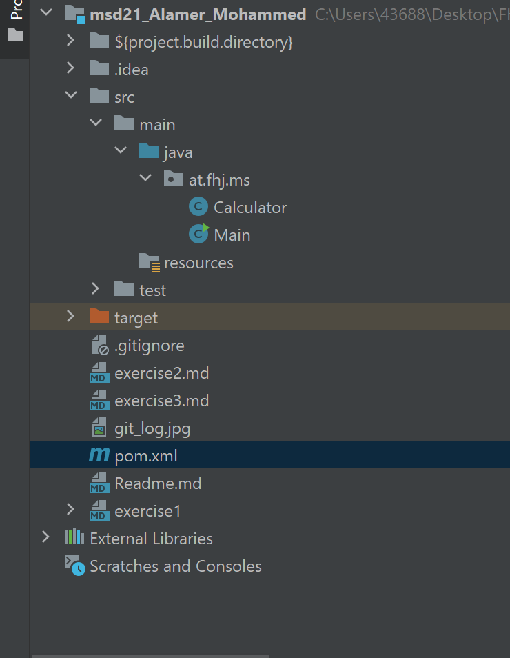

# Exercise 3

## visioning a java project
in this exercise i made a new calculator using two classes:
1. __Calculator__ class, that includes the methods of
basic calculations.
2. __Main__ Class, where the methods are used, to calculate different numbers

## how does the code like?
### main class

### calculator class

## Note
You will notice, that there is a file, that is named __target__ and being created when
the main is runned.

> The target folder is the maven default output folder. When a project is build or packaged, all the content of the sources, resources and web files will be put inside of it, it will be used for construct the artifacts and for run tests

