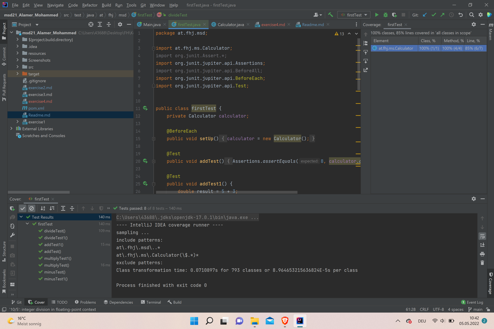
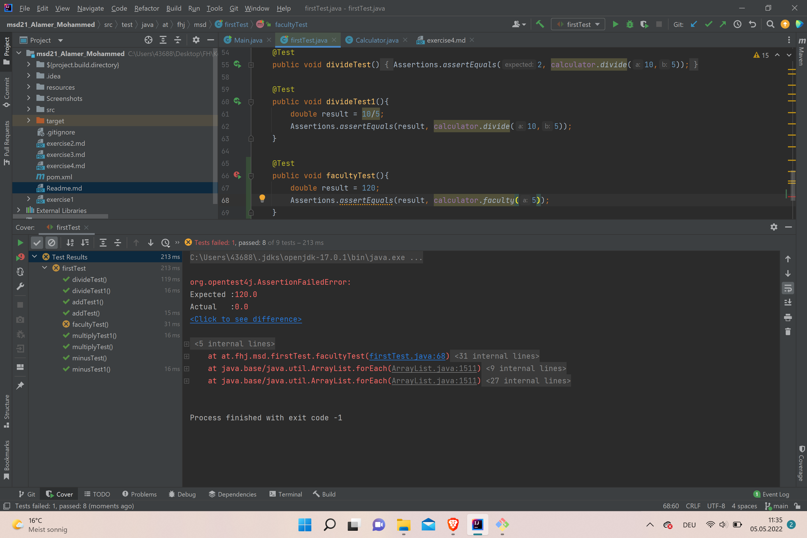

# Exercise 4

in this exercise we are doing out first test experience with **Junit**

### Calculator  
The methods that we are testing belong to the class Calulator:

- `add`
- `minus`
- `multiply`
- `divide`

> this methods are used to perform simple calculations
 
## the test coverage

## a failed case

